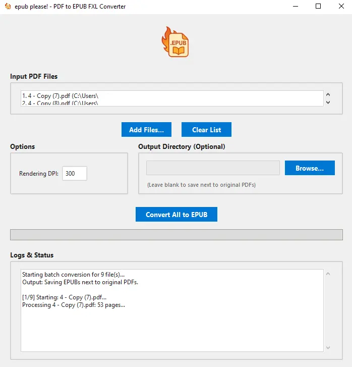

# epub please! - PDF to EPUB FXL Converter

[](assets/tool.webp)

A simple desktop tool to convert PDF files into fixed-layout (FXL) EPUB 3 files, preserving the original page appearance.

---

## ✨ Features

*   Batch convert multiple PDFs.
*   Drag-and-drop support for adding files.
*   Selectable output directory (defaults to saving alongside PDFs).
*   Adjustable rendering DPI for quality/size trade-off.
*   Clean, modern interface.
*   Progress bar and detailed logs during conversion.

---

## ⚙️ Rendering DPI Explained

The DPI (Dots Per Inch) setting controls the resolution of the images generated for each page of your PDF. Higher DPI means better quality but larger file sizes.

*   **150 DPI:** Good balance for general reading on most devices. Smaller file size.
*   **300 DPI:** (Default) Higher quality, suitable for documents with fine details or for viewing on high-resolution screens. Larger file size.
*   **600 DPI:** Very high quality, often unnecessary unless source PDF has extremely fine details or requires archival quality. Significantly larger file size.

Choose the DPI based on your needs for quality versus storage space/portability.

---

## 🚀 Setup & Launch

Make sure you have Python 3 installed.

1.  **Clone or Download:** Get the project files.
2.  **Navigate:** Open your terminal or command prompt and `cd` into the project directory (`PDF2FXL`).
3.  **Install Dependencies:**
    ```bash
    pip install -r requirements.txt
    ```
4.  **Launch:**
    *   **Windows:**
        ```bash
        python epubplease.py
        # or
        py epubplease.py
        ```
    *   **macOS / Linux (Ubuntu, etc.):**
        ```bash
        python3 epubplease.py
        ```

---

## License

This project is licensed under the MIT License - see the details below.

---

**MIT License**

Copyright (c) [2025] [npm-sleep]

Permission is hereby granted, free of charge, to any person obtaining a copy
of this software and associated documentation files (the "Software"), to deal
in the Software without restriction, including without limitation the rights
to use, copy, modify, merge, publish, distribute, sublicense, and/or sell
copies of the Software, and to permit persons to whom the Software is
furnished to do so, subject to the following conditions:

The above copyright notice and this permission notice shall be included in all
copies or substantial portions of the Software.

THE SOFTWARE IS PROVIDED "AS IS", WITHOUT WARRANTY OF ANY KIND, EXPRESS OR
IMPLIED, INCLUDING BUT NOT LIMITED TO THE WARRANTIES OF MERCHANTABILITY,
FITNESS FOR A PARTICULAR PURPOSE AND NONINFRINGEMENT. IN NO EVENT SHALL THE
AUTHORS OR COPYRIGHT HOLDERS BE LIABLE FOR ANY CLAIM, DAMAGES OR OTHER
LIABILITY, WHETHER IN AN ACTION OF CONTRACT, TORT OR OTHERWISE, ARISING FROM,
OUT OF OR IN CONNECTION WITH THE SOFTWARE OR THE USE OR OTHER DEALINGS IN THE
SOFTWARE. 